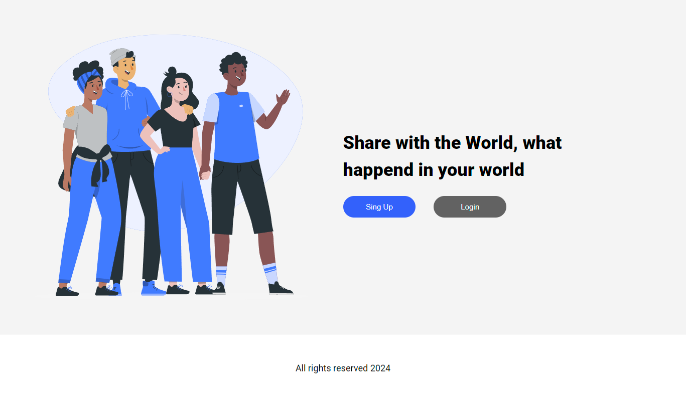
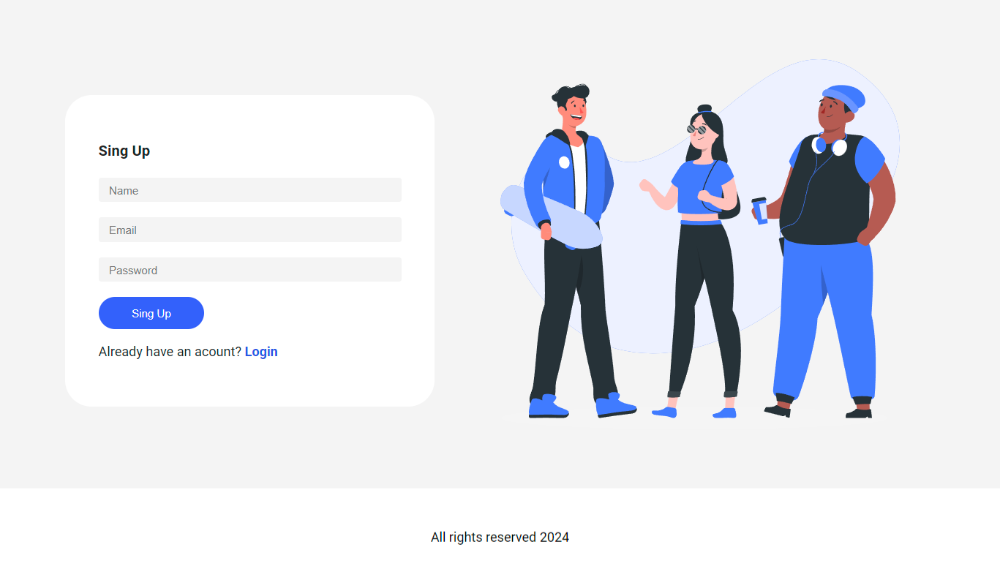
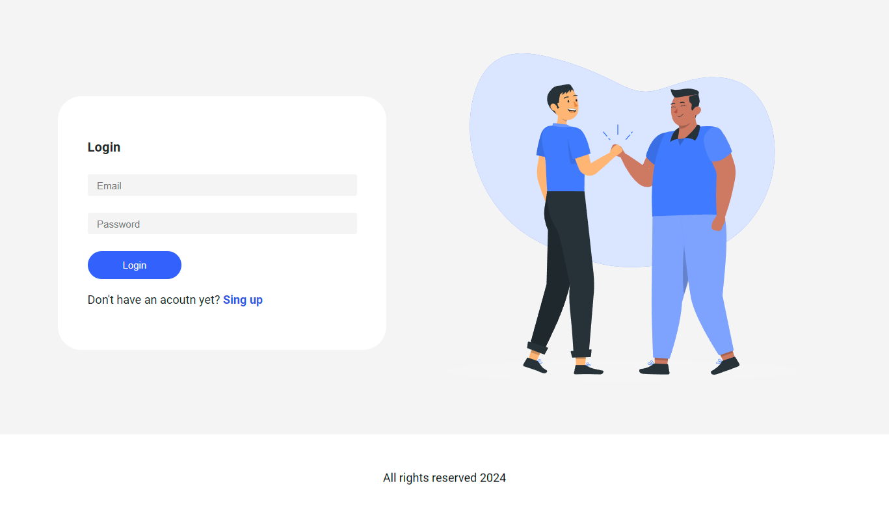
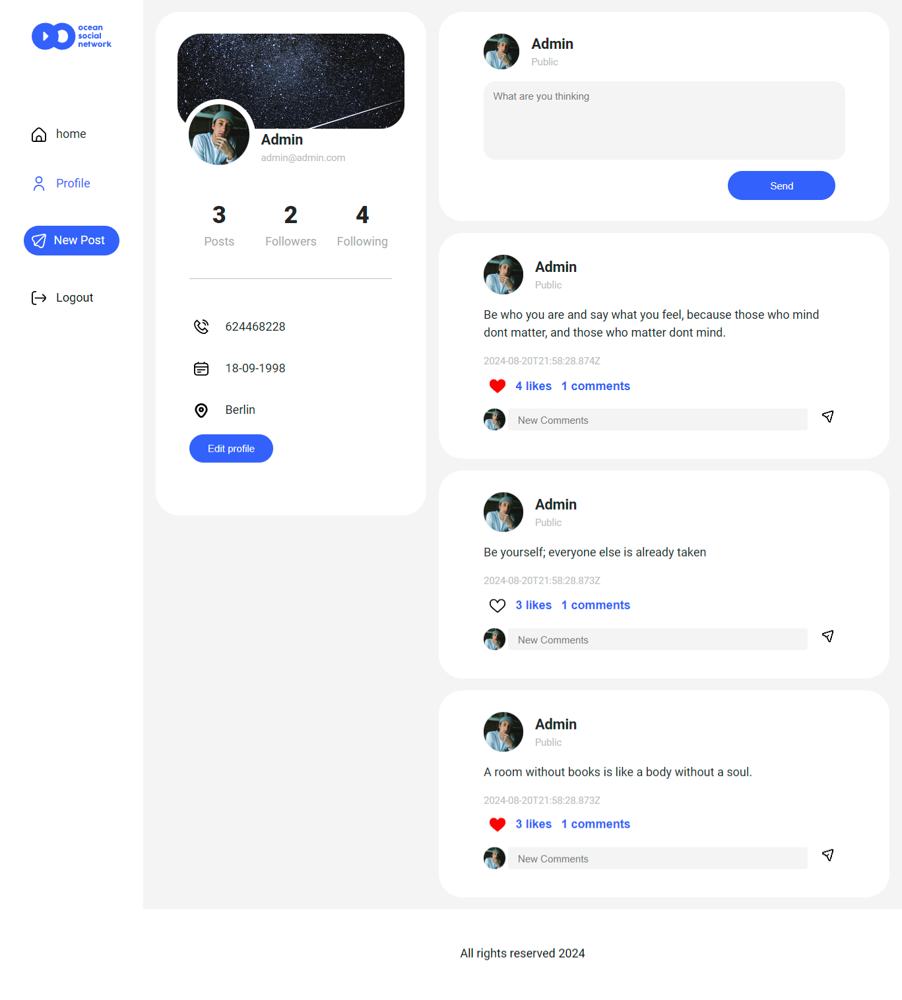
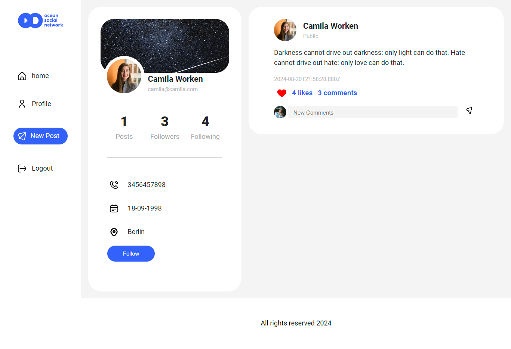
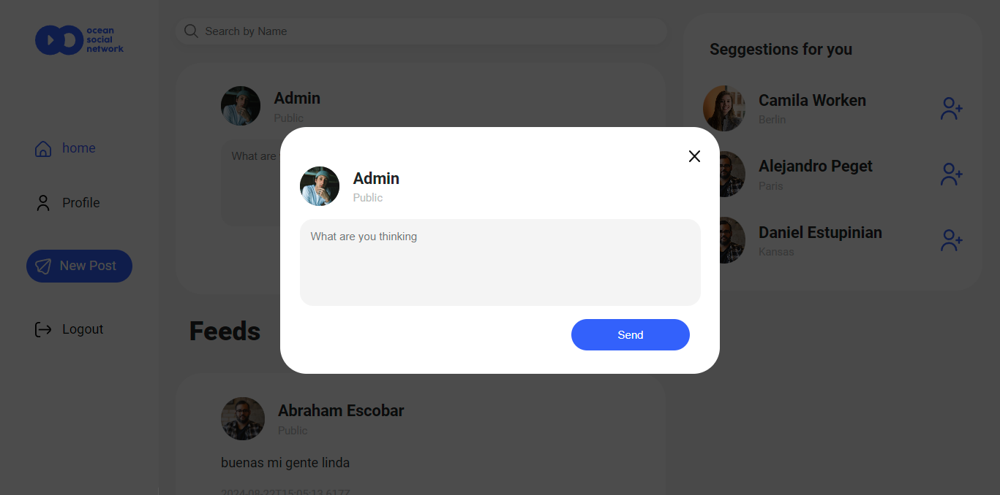
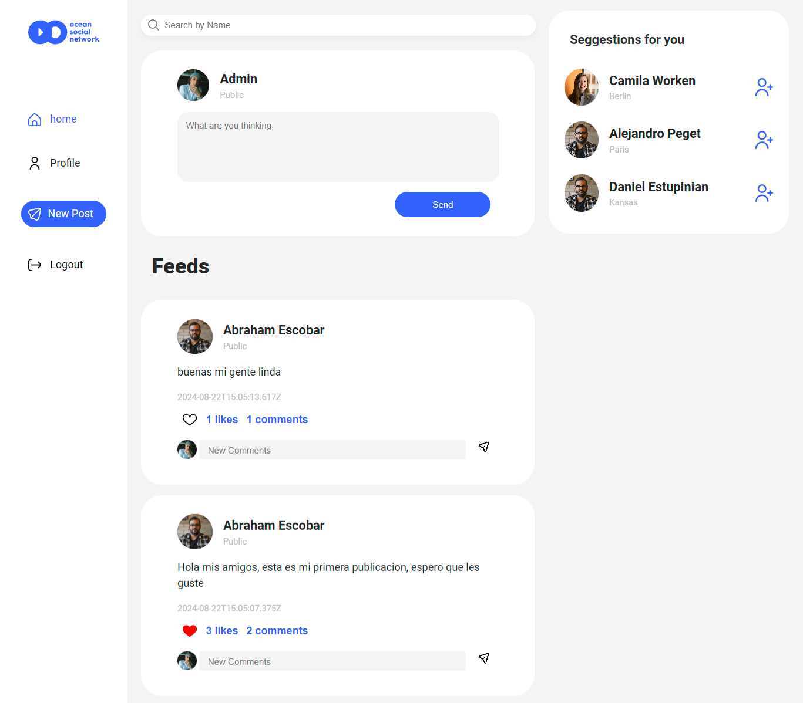
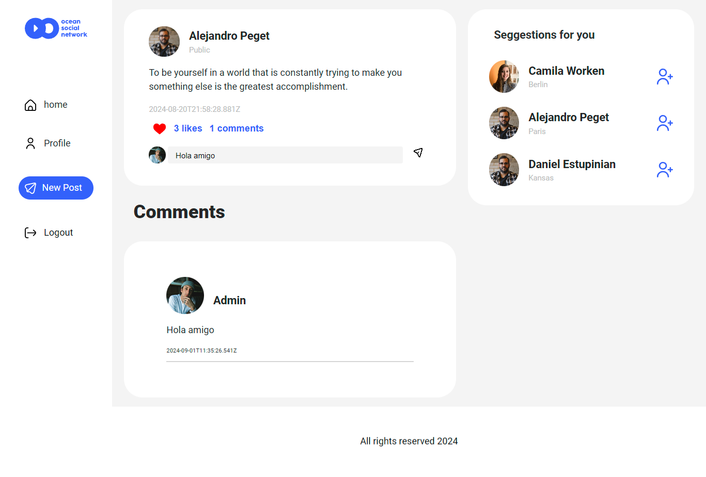

# Social Network (Ocean)
This project involves the frontend development of an existing backend system, implemented using React. It delivers an intuitive and user-friendly interface, facilitating a seamless user experience. The platform, a social networking site, enables dynamic user interactions including posting, following, commenting, and liking content.

## Contents
  <ol>
    <li><a href="#Objective">Objetive</a></li>
    <li><a href="#project-description">Project Description</a></li>
    <li><a href="#stack">Stack</a></li>
    <li><a href="#deploy">Deploy</a></li>
    <li><a href="#local-installation">Local Installation</a></li>
    <li><a href="#future-features">Future Features</a></li>
    <li><a href="#contributions">Contributions</a></li>
    <li><a href="#contact ">Contact</a></li>
  </ol>

  ## Objetive
This project focuses on the frontend implementation of a social network, following the completion of the backend development that manages database interactions. The platform, built using React, provides users with key functionalities such as registration, post creation, and social interaction through following other users, commenting on posts, and liking content. Additionally, each user has a customizable profile where they can update and edit their personal information.

## Project Description

This frontend project has been developed using Node.js as the runtime environment and React as the library for integrating JavaScript and HTML. The plataform includes various views, such as:

- **Home**
- **Login**
- **Sign Up**
- **profile**
- **Single Post**
- **Timeline**
- **New Post**

## Stack
Technologies used for the development of this project: 

<a href="https://www.reactjs.com/">
    
</a>
<a href="https://developer.mozilla.org/es/docs/Web/JavaScript">
    
</a>

## Local Installation

To install and run the project locally, follow these steps:

1. Clone the repository:
    ```sh
    git clone https://github.com/AbrahamEsc1911/FSD-FRONTEND-SOCIAL-NETWORK.git
    cd your-repo
    ```

2. Install project dependencies:
    ```sh
    npm install
    ```

3. Start the frontend development server:
    ```sh
    npm run dev
    ```

4. Set up and start the backend server:
    - Clone the repository:
      ```sh
        git clone Backend https://github.com/AbrahamEsc1911/FSD-API-SOCIAL-NETWORK.git
    - Ensure that the MongoDB database is running.
    - Use the CORS library to allow connections between the frontend and backend.
    - Navigate to the backend directory and execute the following commands:
    ```sh
    cd ../your-repo-backend
    npm install
    npm run dev
    ```

## Screenshots

**Home**

**Sign up**

**Login**

**Profile**

**User Profile**

**New Post**

**Timeline**

**Single Post**


## Future Features

- Make the design fully responsive.
- Allow users to change their passwords.
- Allow users to upload a profile picture.

## Contributions
Suggestions and contributions are always welcome.

You can do it in two ways:

1. Opening an issue
2. Fork the repository
    - Create a new branch
        ```
        $ git checkout -b feature/username-improvement
        ```
    - Commit your changes
        ```
        $ git commit -m 'feat: improve X feature'
        ```
    - Push to the branch
        ```
        $ git push origin feature/username-improvement
        ```
    - Open a Pull Request

    ## Contact 
<a href = "mailto:abrancho1908@gmail.com"></a>
<a href="https://www.linkedin.com/in/abraham-escobar-angola-237a20224/" target="_blank"></a> 
</p>